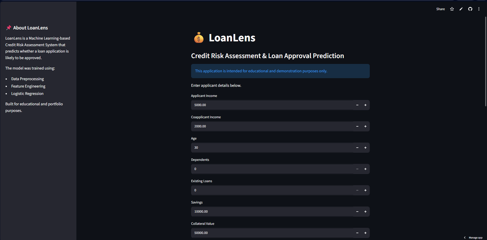
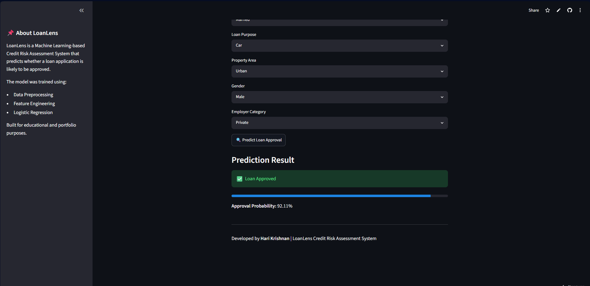

# 💰 LoanLens - Credit Risk Assessment System

A machine learning-powered credit risk assessment and loan approval prediction system built using Python, Scikit-Learn, and Streamlit.

The application evaluates applicant financial and demographic information and predicts whether a loan is likely to be approved based on historical patterns learned by the model.

## 🚀 Live Demo

🔗 https://loanlens-credit-risk-assessment.streamlit.app

---

## 📌 Project Overview

LoanLens is an end-to-end machine learning project that demonstrates the complete ML workflow:

- Data Cleaning & Preprocessing
- Exploratory Data Analysis (EDA)
- Feature Engineering
- Model Training & Evaluation
- Model Selection
- Model Serialization
- Streamlit Deployment

The final deployed model uses **Logistic Regression** and predicts loan approval decisions based on applicant profile information.

---

## ✨ Features

- Applicant financial profile analysis
- Credit risk assessment
- Loan approval prediction
- Feature engineered model inputs
- Approval probability estimation
- Interactive Streamlit web application
- Live cloud deployment

---

## 🖥️ Application Preview

### Home Page



### Prediction Result



---

## 🛠️ Tech Stack

### Languages
- Python

### Data Science Libraries
- Pandas
- NumPy

### Machine Learning
- Scikit-Learn
- Logistic Regression
- Gaussian Naive Bayes

### Deployment
- Streamlit
- Git
- GitHub
- Streamlit Community Cloud

---

## 📊 Model Performance

### Selected Model: Logistic Regression

| Metric | Score |
|----------|----------|
| Accuracy | 87.5% |
| Precision | 79.0% |
| Recall | 80.3% |
| F1 Score | 79.7% |

### Model Comparison

| Model | Accuracy |
|---------|---------|
| Logistic Regression | 87.5% |
| Gaussian Naive Bayes | 86.5% |

Based on overall performance and generalization capability, Logistic Regression was selected as the final deployment model.

---

## ⚙️ Feature Engineering

The following engineered features were introduced to improve model performance:

- DTI Ratio Squared (`DTI_Ratio_sq`)
- Credit Score Squared (`Credit_Score_sq`)

Categorical variables were transformed using One-Hot Encoding.

---

## 📁 Project Structure

```text
loanlens-credit-risk-prediction/
│
├── assets/
│   ├── home_page.png
│   └── prediction_result.png
│
├── app.py
├── loanlens_credit_risk_assessment.ipynb
├── loanlens_model.pkl
├── scaler.pkl
├── feature_names.pkl
├── loan_approval_data.csv
├── requirements.txt
├── README.md
└── .gitignore
```

---

## 🚀 Running Locally

Clone the repository:

```bash
git clone https://github.com/harix10/loanlens-credit-risk-prediction.git
cd loanlens-credit-risk-prediction
```

Install dependencies:

```bash
pip install -r requirements.txt
```

Run the Streamlit application:

```bash
streamlit run app.py
```

---

## 📦 Deployment Files

The following files are used during inference and deployment:

- `loanlens_model.pkl`
- `scaler.pkl`
- `feature_names.pkl`

---

## 🔮 Future Improvements

- Random Forest implementation
- XGBoost comparison
- SHAP explainability
- Loan risk scoring dashboard
- Database integration
- User authentication
- Loan recommendation system

---

## 👨‍💻 Author

**Hari Krishnan**

Computer Science Student | Machine Learning Enthusiast

GitHub: https://github.com/harix10

---

## ⚠️ Disclaimer

This application is developed for educational and portfolio purposes only.

The predictions generated by the model should not be used as actual financial or lending decisions.
